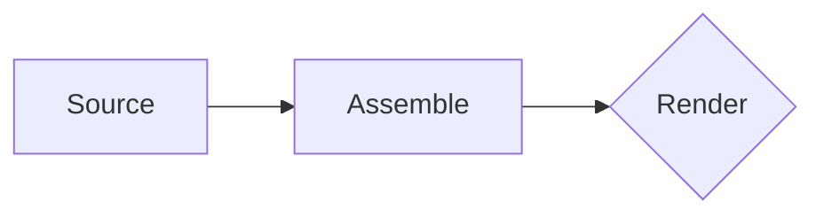

# Lectern

[](https://github.com/bsletten/lectern-slides/actions/workflows/ci.yml)
[](https://pypi.org/project/lectern-slides/)
[](https://pypi.org/project/lectern-slides/)
[](LICENSE)

**Lectern** is a Python CLI that assembles Markdown slide sources — transclusion,
`#1-3` slide ranges, partial search paths — into one deck and renders it via
reveal.js (with remark / marp / quarto as alternates), with a live-reload preview
server and vector PDF export. It's the Markdown front-end to a larger
resource-oriented slide system; the `Source` seam is designed so a semantic-CMS
backend can replace the filesystem later.

Jump to **[Install](#install)** and **[Usage](#usage)** to get going.

## Names (locked)

- **Product / tool:** Lectern
- **CLI command:** `lectern`
- **PyPI distribution + GitHub repo:** `lectern-slides` → `pip install lectern-slides`
- **Python import package:** `lectern`
- **PDF extra:** `lectern-slides[pdf]`
- **License:** MIT (see `LICENSE`); all dependencies are permissive (MIT/BSD/Apache)

## Install

```bash
pip install lectern-slides            # core: assemble + reveal/remark HTML + watch

# PDF export (vector master, imposition, B&W) — pulls Playwright, pypdf, reportlab:
pip install 'lectern-slides[pdf]'
playwright install chromium           # one-time: the headless browser for PDF

# Optional external tools, only for their adapters (each is availability-guarded):
#   marp-cli (npm i -g @marp-team/marp-cli)  → marp adapter: html / pdf / pptx
#   quarto   (quarto.org)                    → quarto adapter: high-quality html
#   ghostscript (brew install ghostscript)   → full-document B&W engine
```

## Usage

`SOURCE` is a **deck directory** (containing `deck.toml`/`lectern.toml`, else
directory order), a **`.toml` manifest**, or a single **`.md` file**.

```bash
# New: scaffold a deck (deck.toml + a couple of slides) in a dir — default: cwd
lectern new                                          # scaffold in the current dir
lectern new ./talks/ai-sec                           # ...or in a dir (created if missing)

# Assemble: expand includes / #1-3 ranges / partials into one Markdown deck
lectern assemble ./talks/ai-sec -o assembled.md     # omit -o to write to stdout

# Check: validate includes/ranges/partials (and surface warnings), no render
lectern check ./talks/ai-sec

# Config: show the effective merged config and where each value came from
lectern config ./talks/ai-sec

# Build: render to the deck's out_dir (default: reveal HTML)
lectern build ./talks/ai-sec                         # -> dist/index.html
lectern build ./talks/ai-sec -t ./themes/mine.css -o site
lectern build ./talks/ai-sec -f outline             # -> dist/outline.md (text transcript)
lectern build ./talks/ai-sec --all-themes            # -> dist/index-<theme>.html, one per theme
lectern build ./talks/ai-sec --all-themes -f pdf     # same, as index-<theme>.pdf

# Live preview: rebuilds on change with SSE reload + build-error overlay
lectern watch ./talks/ai-sec                         # serves http://127.0.0.1:8080
lectern watch ./talks/ai-sec --browser chrome        # open a specific browser (or [serve].browser)

# Clean: remove generated output (the out_dir). --all also drops the PDF cache
lectern clean ./talks/ai-sec                         # removes dist/ (keeps build/ cache)
lectern clean ./talks/ai-sec --all --yes             # also removes build/ (-y skips prompt)
```

`out_dir` (`dist/`) is disposable rendered output; `build_dir` (`build/`) holds
the reusable PDF master cache. `clean` removes `out_dir` and **keeps the cache**
so the next PDF export is fast; `clean --all` removes both. It only ever deletes
the deck's own `out_dir`/`build_dir` (deck-root-relative) — never a source,
partials, theme, or asset directory — and prompts first unless you pass `-y`
(preview with `--dry-run`).

### Configuration

A deck is **external** to this tool. `SOURCE`'s directory (the manifest's folder)
is the **deck root**, resolved to an absolute path, and **every relative path in
the config — `slides`, `partials`, `asset_base`, `theme`, `out_dir`, `build_dir`
— resolves against it**, never your CWD or where Lectern is installed. Absolute
paths and `~` pass through; URLs pass through. So `out_dir`/`build_dir` default to
`dist`/`build` *inside the deck's own repo*.

Config is merged from three layers, **highest precedence first**, over the
built-in defaults:

1. **CLI flags** — `--theme`, `--renderer`, `--asset-base`, `--aspect`, `--out`,
   `--remark-compat`, `--partial` (repeatable), `--max-include-depth`, the PDF
   flags, …
2. the deck's **`deck.toml`** (or `lectern.toml`),
3. a **user config** at `$XDG_CONFIG_HOME/lectern/config.toml` (fallback
   `~/.config/lectern/config.toml`).

The merge is a deep, per-key merge, so a user config can set a house theme and a
shared partials library once and every separate deck repo inherits them (use
absolute/`~` paths there, since relative paths resolve against each deck's root):

```toml
# ~/.config/lectern/config.toml
author   = "Your Name"            # inherited by every deck — never committed per-deck
theme    = "house"                # a bundled name, or an absolute/~ path
partials = ["~/talks/_lib"]
```

Putting `author` here is the recommended way to set your name: `lectern new`
reads it and **leaves it out of the generated `deck.toml`** (a comment notes it's
inherited), so your name is never committed into a deck repo — it's filled in at
build time from this file. With no user-config author, `lectern new` writes an
`author = "Deck Author"` placeholder instead (override with `--author`). **`theme`
works the same way** — `lectern new` inherits a user-config theme rather than
baking one into the deck (a baked-in value would shadow the user config, since
`deck.toml` outranks it); with none set it falls back to `base` (override with
`--theme`).

Inspect the effective, merged config and **where each value came from** with:

```bash
lectern config ./talks/ai-sec                 # value · (cli | deck.toml | user | default)
lectern config ./talks/ai-sec --theme grove   # preview an override before building
lectern config ./talks/ai-sec --list-themes   # themes usable by name (bundled + theme_paths + your theme's folder)
```

The full key reference (top-level + `[serve]`/`[reveal]`/`[marp]`/`[quarto]`/`[pdf]`)
is in `SPECIFICATION.md`. Note: not every key has a flag — `partials`,
`remark_compat`, `max_include_depth`, and `aspect` are exposed on
`build`/`watch`/`assemble`/`check`; the rest are config-only.

### Themes

`theme =` is either a **bundled name** or a **path**:

- **bundled name** (e.g. `theme = "base"`, `"cartesian"`, `"grove"`,
  `"soft-editorial"`) → resolved from the `theme_paths` dirs first (see below),
  then the CSS shipped inside the package at **`src/lectern/themes/<name>.css`**.
  Drop a `.css` in the package dir to ship it by name with the tool. (The
  top-level `themes/` directory and the sample deck's `themes/` are *not* search
  paths — the former is unshipped design source, the latter is deck-local.)
- **path** (`./themes/mine.css`, `~/talks/house.css`, or absolute) → loaded
  directly; a relative path resolves against the deck root.

**`theme_paths` — a reusable theme library without bundling.** Like `partials`,
it's a list of directories where a *bare theme name* resolves (in order, before
the package themes). Set it once in your user config to point at a themes folder
you control, and every deck can use those themes by name — no `~`/absolute path
per deck, no editing the package:

```toml
# ~/.config/lectern/config.toml
theme_paths = ["~/talks/_themes"]    # contains house.css, dark.css, …

# any deck.toml, on any machine that shares that folder:
theme = "house"
```

Relative `theme_paths` entries resolve against the deck root; use absolute/`~`
for a global library. `lectern config SOURCE` shows the resolved `theme_paths`
and which layer set `theme`.

Themes are CSS driven by design tokens (`--bg`, `--accent`, `--font-display`, the
size scale, …) and the Remark-parity classes; the structural layout layer
(`.slide` anchor grid, `.place` boxes) is theme-independent, so a theme swap never
moves content.

### Renderers (`-r/--renderer`, or `renderer =` in the manifest)

| Renderer | Engine | Formats |
| --- | --- | --- |
| `reveal` *(default)* | native reveal.js | `html`, `pdf` |
| `remark` | native remark.js (legacy-deck parity) | `html` |
| `marp` | shells out to `marp-cli` | `html`, `pdf`, `pptx` |
| `quarto` | shells out to `quarto render` | `html` |

The format is gated by the adapter's capabilities; asking for one it can't make
prints a hint toward an adapter that can (e.g. `-f pptx` → *try renderer: marp*).

### Diagrams (Mermaid)

A fenced ` ```mermaid ` block renders to a diagram — it stays valid CommonMark
(degrades to a code block anywhere) and is lowered to a `<pre class="mermaid">`
that the `reveal` and `remark` adapters render client-side:

````markdown

````

Mermaid loads (from a CDN) **only when a diagram is present** — auto-detected,
or forced with `[reveal].mermaid = true|false`. Diagrams are themed from the
deck's design tokens, and the PDF master waits for the async render, so they
appear in the vector PDF too. (For `marp`/`quarto`, or for full control, the
isolated-iframe embed pattern still works in every renderer.)

### Icons (Font Awesome)

Set `font_awesome` in the manifest (or user config) and drop glyphs in with raw
HTML — `<i class="fa-solid fa-rocket"></i>` — anywhere in a slide; they inherit
the theme's text color and embed as vector in the PDF.

```toml
font_awesome = true                                  # free kit, pinned CDN
# font_awesome = "~/decks/_assets/font-awesome"      # a local kit (e.g. Pro), self-hosted
```

`true` links the **free** kit from a pinned CDN (a `<i class="fa-brands fa-…">`
gets brand icons too). A **path** self-hosts a local kit: the directory is copied
**verbatim** into `dist/font-awesome/` (preserving `css/` + `webfonts/`, which the
content-hashing asset pipeline would otherwise break) and linked locally — so a
paid/Pro kit set once in your user config is inherited by every deck, served
same-origin (no CDN, COI-friendly). Mark decorative icons `aria-hidden="true"`,
or give meaningful ones an `aria-label`. Pro-only styles (`fa-thin`,
`fa-duotone`, …) won't render under the free kit, so keep shareable decks to
`fa-solid`/`fa-regular`/`fa-brands`.

### Images

A standalone Markdown image (`` on its own line) **fills the space the
slide's heading/body leave** — generous on an image-only slide, smaller when
there's also text — scaled to fit (up or down) with no distortion or overflow,
under any theme. So a diagram slide is usually just:

```markdown
<!-- slide: .center .middle -->


```

To size **one** image differently, either add a reveal element comment right
after it, or use a raw `` (which bypasses the fill rule):

```markdown

<!-- .element: style="max-width: 40%;" -->
```
```html
   <!-- ~px in the 1280×720 grid -->
```

(Inline images — not alone on a line — are left at their natural size.)

### Speaker notes

Attach speaker notes to a slide with an HTML-comment block (or the equivalent
fenced div). They never appear on the slide itself — adapters route them to the
presenter view (reveal's speaker window, marp/quarto/remark equivalents):

```markdown
# Threat model

<!-- notes -->
Walk the diagram left to right; the trust boundary is the dashed line.
<!-- /notes -->

::: {.notes}
Fenced-div form — handy when a note itself contains HTML comments.
:::
```

Add the `presenter` category for notes that should stay on stage but **not** be
printed in the PDF handout — pacing reminders, asides, "skip if running long":

```markdown
<!-- notes:presenter -->
Eight minutes per section to land on time.
<!-- /notes -->

::: {.notes .presenter}
Same, fenced-div form.
:::
```

Ordinary notes show in the presenter view **and** the `*-notes` PDF layouts;
`presenter` notes show in the presenter view **only**. A mistyped category is
flagged by `lectern check` and treated as an ordinary note, so it can't silently
leak into print.

### PDF export (`-f pdf`)

```bash
lectern build ./talks/ai-sec -f pdf                  # 2up-notes handout (default)
lectern build ./talks/ai-sec -f pdf --layout 1up     # clean projection slides
lectern build ./talks/ai-sec -f pdf --ink-saver --paper letter
```

A single **vector master** is printed once (headless Chromium) and then imposed;
re-exporting another layout/color reuses the cached master.

| Flag | Effect |
| --- | --- |
| `--layout` | `1up`, `2up`, `2up-notes`, `4up`, `6up`, `3up-notes` |
| `--paper` | `deck`, `letter`, `a4`, or `WxH` (multi-up defaults to `letter`) |
| `--bw` | grayscale (vector `tokens` engine; `ghostscript` for raster too) |
| `--no-backgrounds` | drop background fills/images for clean paper |
| `--light-inverse` | flip dark slides to light for ink economy |
| `--ink-saver` | `--bw` + `--no-backgrounds` + `--light-inverse` |

All knobs also live under `[pdf]` in the manifest (CLI flags win). See
`PDF-EXPORT.md` for the full set and `SPECIFICATION.md` for the source format and
config reference. Run `lectern --help` (or `lectern build --help`) for everything.

## Accessibility

`lectern check` runs an accessibility audit by default (turn it off with
`--no-a11y`). Like every Lectern diagnostic, each warning is **source-cited** —
`file:line` or theme — so you can act on it. It flags the issues that genuinely
break a screen-reader experience, and nothing noisy:

- **Every slide needs an accessible name** — a heading *or* a `label`. Give an
  image- or quotation-only slide a name with the slide directive:

  ```markdown
  <!-- slide: label="Loki and Freyja peering through the deck rails" -->
  ```

  `label` lowers to `aria-label` on the reveal `<section>` (`aria-label="…"`
  works too). This is the right tool for a full-bleed `data-background-image`
  slide, which has no alt slot of its own.
- **Images carry alt text** via standard Markdown — ``. An empty alt (``) is the correct,
  intentional way to mark an image *decorative*, so it isn't flagged. A *raw*
  `` (HTML passthrough) with **no `alt` attribute at all** is flagged — add
  `alt="…"` (or `alt=""` to mark it decorative).
- **`<iframe>` embeds need a `title=`** (the D3/WebGL demos) for an accessible
  name.
- **Font Awesome icons need `aria-hidden="true"`** (decorative) **or an
  accessible name** (`aria-label`/`title`); a bare `<i class="fa-…">` is read as
  nothing or garbage by a screen reader, so it's flagged.
- **Mermaid diagrams need an `accTitle`/`accDescr`** in the diagram source —
  Mermaid renders them to the SVG's `<title>`/`<desc>` (+ `aria-labelledby`), a
  text alternative for the graphic:

  ````markdown
  ```mermaid
  flowchart LR
    accTitle: Request flow
    accDescr: The client calls the gateway, which routes to the services.
    Client --> Gateway --> Services
  ```
  ````
- **Themes ship AA contrast.** The audit checks each theme's `--fg`/`--bg` and
  `--inverse-*` text tokens against WCAG AA (4.5:1), and `--accent` — a graphical
  element (rules, list markers, mermaid diagram lines) — against WCAG non-text
  (3:1).
- **`.on-dark`** forces light, legible text (and links, plus a soft shadow) over
  a dark backdrop, independent of a theme's `.inverse` treatment — reach for it
  on a dark background-image slide:
  `<!-- slide: .on-dark data-background-image="night.jpg" -->`.
- **Region landmarks + focus** — each slide `<section>` is named (an ARIA
  `region`) from its heading (or its explicit `label`), so screen-reader users
  can navigate slide-to-slide; interactive content shows a visible
  `:focus-visible` outline for keyboard users. On navigation the current slide
  ("Slide 3 of 18: …") is announced via a polite `aria-live` region.
- **Outline export** — `-f outline` writes a linear, heading-structured Markdown
  transcript (`outline.md`): each slide's heading (or its `label`), prose body
  with directives stripped, and the speaker notes as prose; Mermaid diagrams
  collapse to their `accDescr`. A screen-reader transcript / no-JS, crawlable
  fallback, independent of any render framework.
- **Document language** — set `lang` (a BCP 47 tag like `en`, `fr`, `de`) in the
  config so assistive tech pronounces the content correctly; it becomes
  `<html lang>` (and the marp/quarto front-matter `lang`). Defaults to `en`.
- **Tagged PDF** — `-f pdf --layout 1up` emits a *tagged* (structured) PDF:
  headings, paragraphs, lists, and tables carry structure tags, and `<html lang>`
  becomes the PDF's `/Lang`, so screen readers can read the export. (Tagging is
  on by default; the structure survives the `1up` master — N-up imposition
  flattens it. `[pdf].tagged = false` to disable.)
- **Forced colors** — under Windows High Contrast / `forced-colors: active`, links
  are underlined (not distinguished by color alone) and the keyboard-focus ring
  uses the system `Highlight` color, so cues survive the OS palette override.
- **Reduced motion** — the live deck honors `prefers-reduced-motion: reduce`:
  reveal's slide/fragment/background transitions are zeroed, so slides change
  instantly (fragments still step, they just don't animate). The PDF master
  already renders with reduced motion.

The bundled `examples/sample-deck` passes the audit, and a test keeps it that way
as slides are added.

## What's here

```
src/lectern/       ← the implementation: assemble · render adapters · pdf · serve · theming
src/lectern/themes/     ← bundled themes (base, cartesian, grove, soft-editorial); add one here to ship it by name
tests/             ← unit + golden-file + render/PDF tests
SPECIFICATION.md   ← the full functional + technical spec (the substance)
PDF-EXPORT.md      ← the PDF strategy (vector master → 2-up-with-notes, B&W, posters)
CLAUDE.md          ← the operating manual: build order, conventions, milestones
ROADMAP.md         ← phases: assemble → render/watch → adapters → components → CMS
deck.toml          ← a minimal starter manifest (root example)
examples/sample-deck/   ← a complete reference deck that exercises every feature
    deck.toml · slides/ · _partials/ · assets/ · themes/ (paper · midnight)
    README.md           ← how the sample maps to features
```

## Development

```bash
uv sync --extra pdf                              # runtime + dev + PDF deps
uv run pytest                                    # unit + golden + render/PDF tests
uv run ruff check . && uv run ruff format --check .
```

The PDF/render tests that need a browser are skipped unless Chromium is present
(`uv run playwright install chromium` to enable them). Lectern was built milestone
by milestone (M1 assemble → M6 PDF finishing); `CLAUDE.md` is the operating manual
and remains the guide for further work with Claude Code, and `ROADMAP.md` covers
what's beyond v1 (component embeds, then a graph/CMS `Source` backend).

## Design decisions

- Default renderer: **reveal** (native, no external binary); **remark** is the
  legacy-parity adapter; **marp**/**quarto** are opt-in subprocess adapters,
  availability-guarded. No mandatory Pandoc.
- Source directives live in **HTML comments** so raw `.md` stays valid CommonMark.
- Core stays dependency-light; **Playwright + pypdf + reportlab** are the
  `lectern-slides[pdf]` extra, imported lazily.
- Manifests are **TOML**; the PDF default is **2up-notes** (one vector master,
  imposed two-up with the real speaker notes beside each slide).
- The `Source` protocol, adapter registry, theme token contract, and `[serve].coi`
  headers are seams kept clean so later phases (components, CMS backend) stay cheap.
