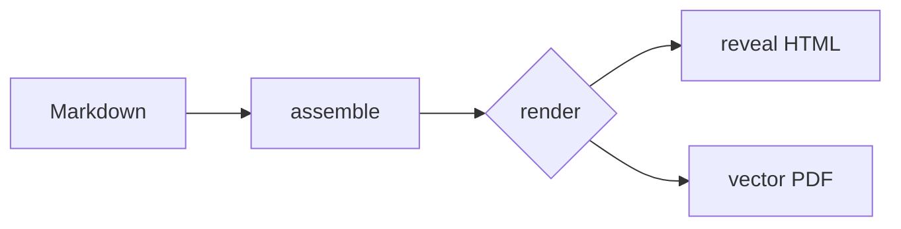

# Diagrams — Mermaid

A fenced ` ```mermaid ` block renders to a diagram, themed from the deck's design
tokens — live in the deck **and** in the vector PDF. No iframe, no setup; the
renderer loads Mermaid only when a diagram is present.


